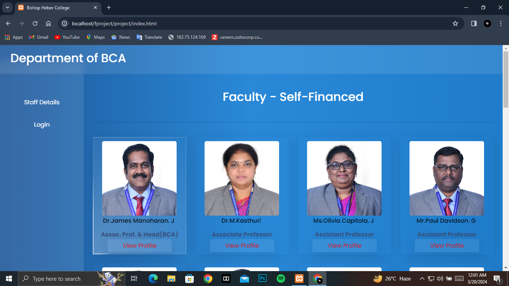
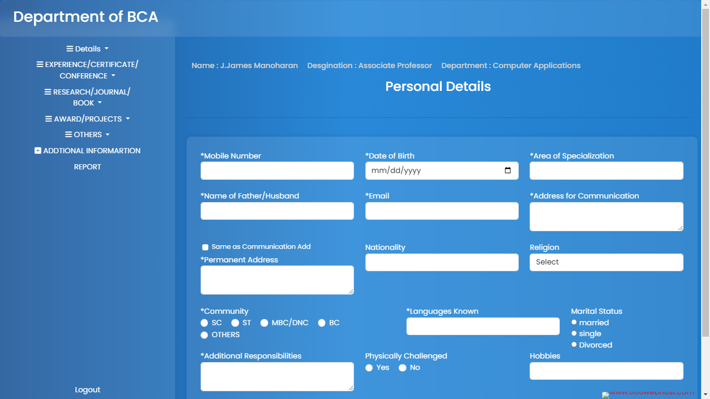
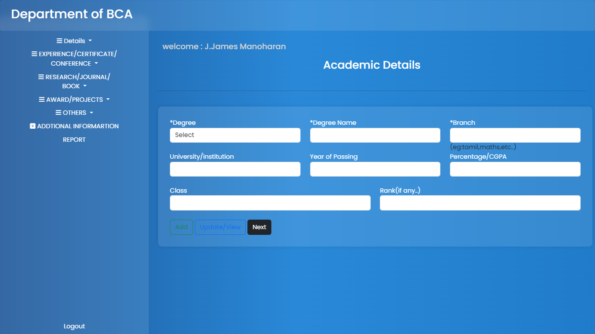
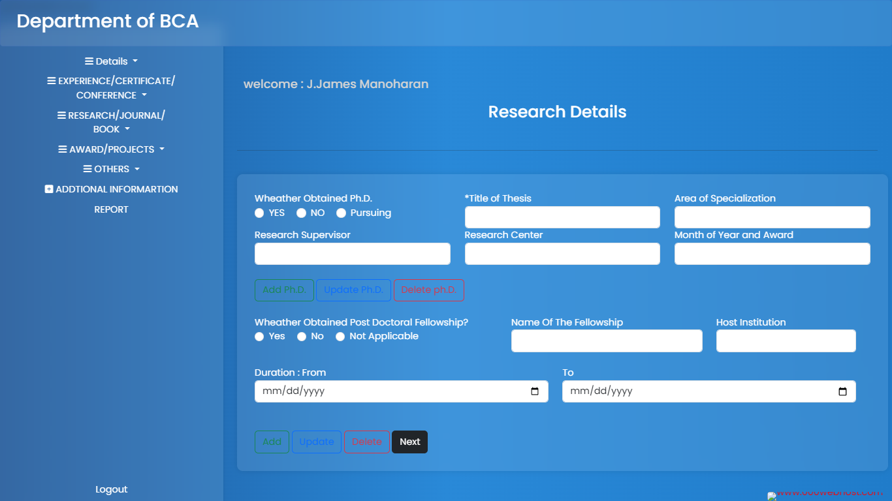
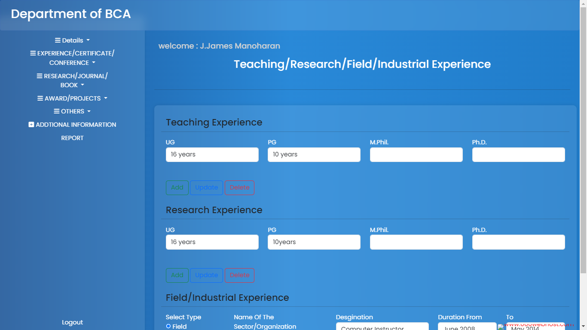
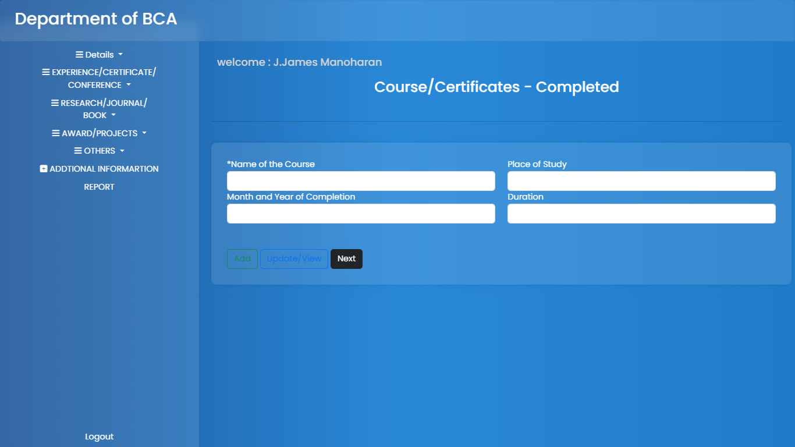
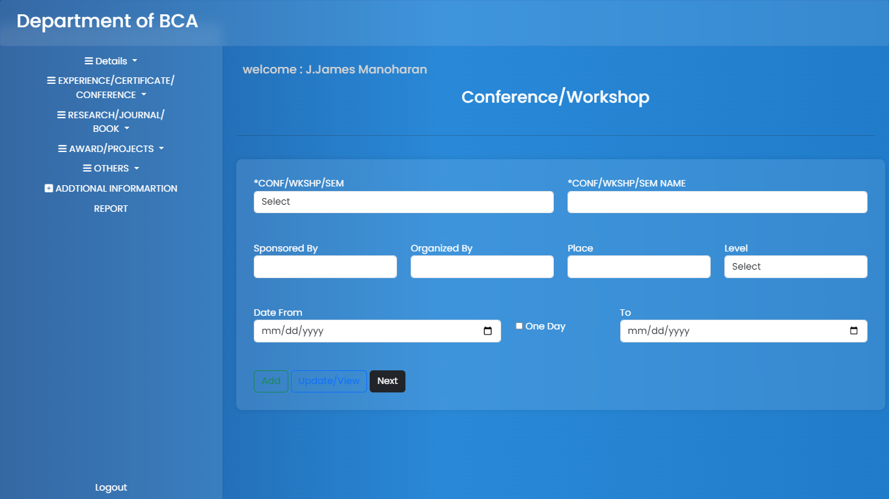

# final-yr-project
This is my final year project-Staff Management System for BCA Department

Abstract:

The Project  is entitled as “Staff Management System” is designed for BCA department staff’s to enhance the staff profile and to keep the track of the department staff updated work. 
This project consist of two Categories : one is for staff’s login, which redirects to another page where each and every staff member from BCA department can update their details by themselves. The other category is for user view, where every student’s and staff member can see the details of BCA department staff’s  recent research paper and their educational qualification, achievements.

